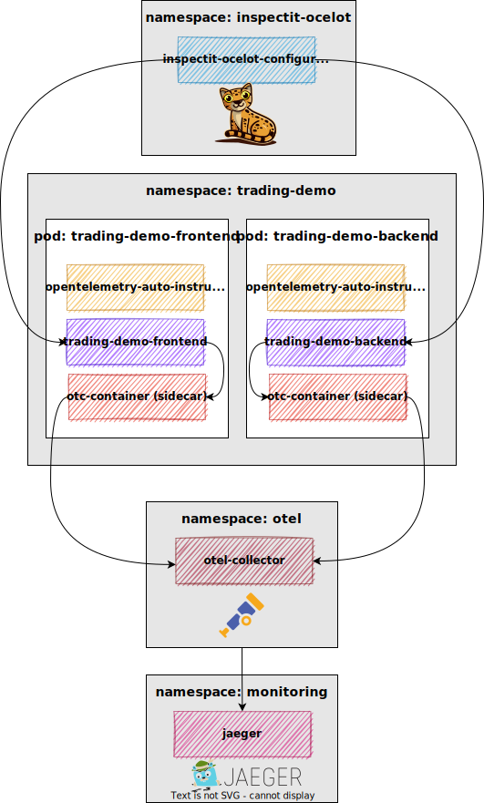
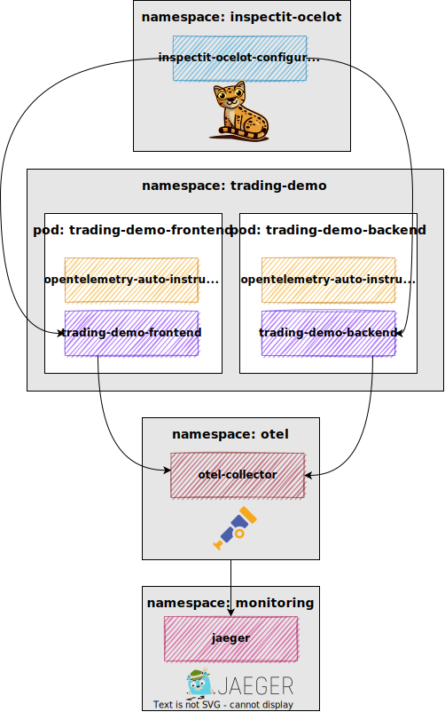
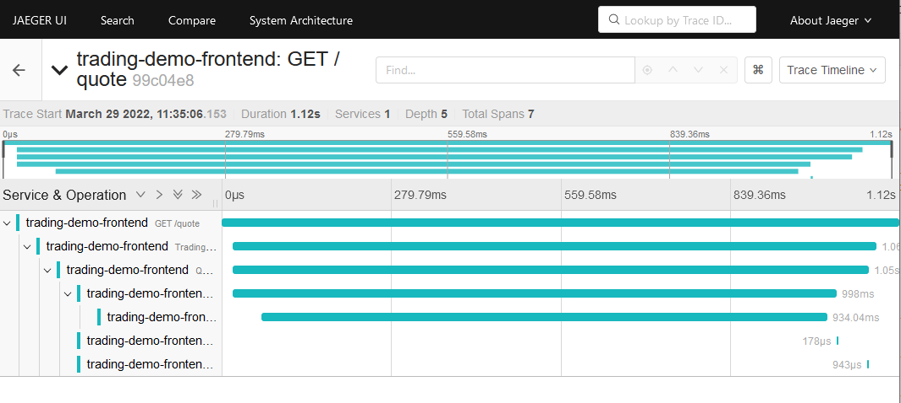

# Trading-Demo in Kubernetes instrumented with inspectIT Ocelot and OpenTelemetry Collector

This demo deploys the [trading demo application](https://github.com/inspectIT/trading-demo-application) to Kubernetes and adds instrumentation with [inspectIT Ocelot](https://github.com/inspectIT/inspectit-ocelot) and the [OpenTelemetry Collector](https://github.com/open-telemetry/opentelemetry-collector) and exports traces to [Jaeger](https://www.jaegertracing.io/). The inspectIT Ocelot Agent and OpenTelemetry Collector Agent Sidecar injection is done with the [OpenTelemetry Operator](https://github.com/open-telemetry/opentelemetry-operator).

This tutorial based on the official [inspectIT Ocelot installation documentation](https://inspectit.github.io/inspectit-ocelot/docs/next/getting-started/installation#using-the-agent-with-kubernetes).

<p align="center">

</p>

> Please **note** that we are showcasing to deploy the OpenTelemetry Collector Agent as a sidecar for illustrative purposes. The sidecar in this demo just receives, batches, and exports the traces. Imagine a use case in which a lot of traces received by the OpenTelemetry Collector should be filtered out, e.g., when a lot of readiness or liveliness probes are sent. In this scenario, it may be good to filter out these traces as close to the instrumented application as possible before sending the final traces over the network to the Collector deployment or to a Jaeger backend. Further, the OpenTelemetry Collector `deployment` also just received, batches, and exports the traces to Jaeger. Imagine a use case where we receive traces from different use cases. In this case, standardization of the traces using the OpenTelemetry Collector is a good way before sending the traces to the desired backend.
>
> However, the alternative to deploy the trading demo application without the sidecar and directly export to the OpenTelemetry Collector deployment  (or event to the Jaeger backend) may be more appropriate in the given context.

## 1. Requirements

1. Install and deploy the [OpenTelemetry Operator](https://github.com/open-telemetry/opentelemetry-operator) as described in the official [readme](https://github.com/open-telemetry/opentelemetry-operator#getting-started).
   1. Install the [cert-manager](https://cert-manager.io/docs/installation/)

      ```shell
      kubectl apply -f https://github.com/cert-manager/cert-manager/releases/download/v1.7.1/cert-manager.yaml
      ```

   2. Install [Ingress](https://kubernetes.github.io/ingress-nginx/deploy/)

      ```shell
      kubectl apply -f https://raw.githubusercontent.com/kubernetes/ingress-nginx/controller-v1.1.2/deploy/static/provider/cloud/deploy.yaml
      ```

   3. Install the operator using the following command. Please note that this will install the latest version of it:

      ```shell
      kubectl apply -f https://github.com/open-telemetry/opentelemetry-operator/releases/latest/download/opentelemetry-operator.yaml
      ```

      By adjusting the URL to a different GitHub release, a specific version of the operator can be used:

       ```shell
       kubectl apply -f https://github.com/open-telemetry/opentelemetry-operator/releases/download/v{version}/opentelemetry-operator.yaml
       ```
      * If you follow the instruction, it automatically deploys the OpenTelemetryCollector to the `opentelemetry-operator-system` namespace
2. Create the namespace `trading-demo` in which the [Trading Demo Application](#3-deploy-the-trading-demo-application), the [inspectIT Ocelot Instrumentation](#1-deploy-inspectit-ocelot-agent-as-an-instrumentation), and the [OpenTelemetry Collector Agent Sidecar](#2-deploy-the-opentelemetry-collector-agent-sidecar) will be deployed

   ```shell
   kubectl create namespace trading-demo
   ```
## 2. Install and deploy [Jaeger](https://www.jaegertracing.io/) in the namespace `monitoring`

You can install Jaeger either via the [Jaeger Operator](https://www.jaegertracing.io/docs/1.32/operator/) or as a [standalone all-in-one solution](#2-alternatively-install-the-standalone-version).

### 1. Using the Jaeger Operator

1. Install the [Jaeger Operator](https://www.jaegertracing.io/docs/1.32/operator/) using the following commands. Please note that his will install the latest version of it:

   ```shell
   # create the namespace that Jaeger will live in 
   kubectl create namespace monitoring
            
   kubectl create -f https://github.com/jaegertracing/jaeger-operator/releases/download/v1.32.0/jaeger-operator.yaml -n monitoring 
   ```

2. Deploy`Jaeger-all-in-one` in the `monitoring` namespace

   1. Create `jaeger-all-in-one.yaml` file
      ```yaml
      apiVersion: jaegertracing.io/v1
      kind: Jaeger
      metadata:
        name: jaeger
      ```

   2. Deploy `Jaeger-all-in-one`

      ```shell
      kubectl apply -f ./jaeger-all-in-one-standalone.yaml -n monitoring
      ```

3. Alternatively, deploy via 

   ```shell
   cat << EOF | kubectl apply -n monitoring -f -
   apiVersion: jaegertracing.io/v1
   kind: Jaeger
   metadata:
     name: jaeger
   ```
### 2. Alternatively, install the standalone version
If you don't want to install Jaeger via the Jaeger Operator, you can also deploy an all-in-one solution specified in `./jaeger/jaeger-all-in-one-standalone.yaml`, which is from https://github.com/hashfyre/otel-k8s and adjusted to the needs of this demo

1. Deploy Jaeger
  ```shell
  # create the namespace that Jaeger will live in
  kubectl create namespace monitoring
     
  # deploy Jaeger
  kubectl apply -f ./jaeger/jaeger-all-in-one-standalone.yaml
  ```

2. Verify the deployment
   ```shell
   kubectl get all -n monitoring
   ```

   * the result should look similar to this if you deployed the standalone version:
     ```shell
     NAME                          READY   STATUS    RESTARTS        AGE
     pod/jaeger-7594d99f98-szdll   1/1     Running   1 (3d22h ago)   5d3h
        
     NAME             TYPE        CLUSTER-IP   EXTERNAL-IP   PORT(S)                         AGE
     service/jaeger   ClusterIP   None         <none>        16686/TCP,14268/TCP,14250/TCP   5d18h
        
     NAME                     READY   UP-TO-DATE   AVAILABLE   AGE
     deployment.apps/jaeger   1/1     1            1           5d18h
        
     NAME                                DESIRED   CURRENT   READY   AGE
     replicaset.apps/jaeger-7594d99f98   1         1         1       5d3h
     replicaset.apps/jaeger-84c88d694f   0         0         0       5d18h
     ```

3. Use `port-forward` to access the Jaeger UI on localhost on port 16686 ([http://localhost:16686](http://localhost:16686))

   > open a new terminal
   
   ```shell
   # for the Jaeger deployed with the Jaeger Operator
   kubectl port-forward -n monitoring service/jaeger-query 16686
      
   # for the standalone Jaeger-all-in-one deployment
   kubectl port-forward -n monitoring service/jaeger 16686
   ```

## 2. Deploy OpenTelemetry Collector

In this example, we will deploy the OpenTelemetryCollector as a `deployment` that receives traces either from the OpenTelemetry Collector Agent `sidecar` or from the trading demo application directly.

### 1. The OpenTelemetry Collector as  `Deployment`

The OpenTelemetry Collector as `Deployment` will be used to receive traces sent via Jaeger or OTLP, process the traces, and export them to our Jaeger collector and to system out (logging).

* The file `./otel-collector.yaml` deploys the OpenTelemetry Collector as a `Deployment` in the namespace `otel`. 

  1. Deploy the OpenTelemetry Collector `deployment` in the namespace `otel`

    ```shel
    kubectl apply -f ./otel/otel-collector.yaml
    ```

    - the `Service` opens the relevant ports for receiver and exporter

    - the `ConfigMap` specifies the [configuration](https://opentelemetry.io/docs/collector/configuration/)
      * in the demo, we receive Jaeger and OTLP traces and export them to Jaeger and logging. For processors, we only use `batch` and `memory_limiter`.

    * the `Deployment` deploys the OpenTelemetry Collector with respective ports and the `ConfigMap` as configuration

    ```yaml
    apiVersion: v1
    kind: Service
    metadata:
      name: otel-collector
      namespace: otel
      labels:
        app: opentelemetry
        component: otel-collector
    spec:
      ports:
        - name: otlp-grpc # Default endpoint for OpenTelemetry gRPC receiver.
          port: 4317
          protocol: TCP
          targetPort: 4317
        - name: otlp-http # Default endpoint for OpenTelemetry HTTP receiver.
          port: 4318
          protocol: TCP
          targetPort: 4318
        - name: metrics # Default endpoint for querying metrics.
          port: 8888
        - name: prometheus # Prometheus exporter
          protocol: TCP
          port: 8889
          targetPort: 8889
        - name: jaeger-ace # Jaeger ACE receiver
          port: 6831
          protocol: TCP
        - name: jaeger-inspectit # Jaeger inspectIT Ocelot receiver
          port: 14268
          targetPort: 14268
          protocol: TCP
      selector:
        component: otel-collector
    ---
    apiVersion: v1
    kind: ConfigMap
    metadata:
      name: otel-collector-conf
      namespace: otel
      labels:
        app: opentelemetry
        component: otel-collector-conf
    data:
      otel-collector-config: |
        receivers:
          otlp:
            protocols:
              grpc:
              http:
          jaeger:
            protocols:
              thrift_compact:
              thrift_binary:
              thrift_http:
        processors:
          batch:
          memory_limiter:
            # 80% of maximum memory up to 2G
            limit_mib: 1500
            # 25% of limit up to 2G
            spike_limit_mib: 512
            check_interval: 5s
        extensions:
          zpages: {}
          memory_ballast:
            # Memory Ballast size should be max 1/3 to 1/2 of memory.
            size_mib: 683
        exporters:
          jaeger: 
            endpoint: "jaeger.monitoring:14250"
            tls:
              insecure: true
          logging:
        service:
          extensions: [zpages, memory_ballast]
          pipelines:
            traces/1:
              receivers: [otlp, jaeger]
              processors: [memory_limiter, batch]
              exporters: [jaeger, logging]
          telemetry:
            logs:
              level: "info"
    ---
    apiVersion: apps/v1
    kind: Deployment
    metadata:
      name: otel-collector
      namespace: otel
      labels:
        app: opentelemetry
        component: otel-collector
    spec:
      selector:
        matchLabels:
          app: opentelemetry
          component: otel-collector
      minReadySeconds: 5
      progressDeadlineSeconds: 120
      replicas: 1
      template:
        metadata:
          labels:
            app: opentelemetry
            component: otel-collector
        spec:
          containers:
            - command:
                - "/otelcol"
                - "--config=/conf/otel-collector-config.yaml"
              image: otel/opentelemetry-collector:0.47.0
              name: otel-collector
              resources:
                limits:
                  cpu: 1
                  memory: 2Gi
                requests:
                  cpu: 200m
                  memory: 400Mi
              ports:
                - containerPort: 55679 # Default endpoint for ZPages.
                - containerPort: 4317 # Default endpoint for OpenTelemetry receiver.
                - containerPort: 14250 # Default endpoint for Jaeger gRPC receiver.
                - containerPort: 14268 # Default endpoint for Jaeger HTTP receiver.
                - containerPort: 9411 # Default endpoint for Zipkin receiver.
                - containerPort: 8888  # Default endpoint for querying metrics.
              volumeMounts:
                - name: otel-collector-config-vol
                  mountPath: /conf
          volumes:
            - configMap:
                name: otel-collector-conf
                items:
                  - key: otel-collector-config
                    path: otel-collector-config.yaml
              name: otel-collector-config-vol
    ```

  2. Verify the deployment
     ```shell
     kubectl get all -n otel
     ```

     * the result should look similar to this: 
       ```shel
       NAME                                 READY   STATUS    RESTARTS   AGE
       pod/otel-collector-5698989fd-w4ddz   1/1     Running   0          15s
       
       NAME                     TYPE        CLUSTER-IP     EXTERNAL-IP   PORT(S)                                                  AGE
       service/otel-collector   ClusterIP   10.107.64.43   <none>        4317/TCP,4318/TCP,8888/TCP,8889/TCP,6831/TCP,14268/TCP   15s
       
       NAME                             READY   UP-TO-DATE   AVAILABLE   AGE
       deployment.apps/otel-collector   1/1     1            1           15s
       
       NAME                                       DESIRED   CURRENT   READY   AGE
       replicaset.apps/otel-collector-5698989fd   1         1         1       15s
       ```

### 2. Deploy the OpenTelemetry Collector Agent `sidecar`

> **Important**: If you do not want to inject the OpenTelemetry Collector Agent as a `sidecar` and directly send the traces to the [OpenTelemetry Collector deployment](#1-the-opentelemetry-collector-as--deployment), you can skip this step and re-configure Jaeger endpoint url in the [inspectIT Ocelot Configuration Server](#2-deploy-the-inspectit-ocelot-configuration-server).

We will inject an OpenTelemetry Collector as a `sidecar` into the trading demo application using the [OpenTelemetry Operator](https://github.com/open-telemetry/opentelemetry-operator#sidecar-injection). 

> **Important:** if you have not yet created the namespace `trading-demo`, do so! (`kubectl create namespace trading-demo`)

* The file located in `./otel/otelcol-agent-sidecar.yaml` deploys an `OpenTelemetryCollector` with the `mode: sidecar`

  1. Deploy the OpenTelemetry Collector Agent `sidecar` in the namespace `trading-demo`

     ```shel
     kubectl apply -f ./otel/otelcol-agent-sidecar.yaml -n trading-demo
     ```
  
     > **Important: ** the OpenTelemetry Collector Agent sidecar must be deployed in the same namespace as the target application, which is `trading-demo` for this tutorial.
  
     - we configure the OpenTelemetry Collector sidecar to receive traces via OTLP and Jaeger and export them to the [OpenTelemetry Collector deployment](#1-the-opentelemetry-collector-as--deployment) and to the system out (logging). We again only use the `memory_limiter` and `batch` exporter
  
     ```yaml
     ---
     apiVersion: opentelemetry.io/v1alpha1
     kind: OpenTelemetryCollector
     metadata:
       name: otelcol-sidecar
     spec:
       mode: sidecar
       config: |
         receivers:
           otlp:
             protocols:
                grpc:
                http:
           jaeger:
             protocols:
               grpc:
               thrift_binary:
               thrift_http:
               thrift_compact:
         exporters:
           otlp:
             endpoint: "otel-collector.otel.svc.cluster.local:4317"
             tls:
               insecure: true
           logging:
         processors:
           batch:
           memory_limiter:
            # 80% of maximum memory up to 2G
            limit_mib: 400
            # 25% of limit up to 2G
            spike_limit_mib: 100
            check_interval: 5s
         extensions:
           zpages: {}
           memory_ballast:
             # Memory Ballast size should be max 1/3 to 1/2 of memory.
             size_mib: 165
         service:
           extensions: [zpages, memory_ballast]
           pipelines:
             traces:
               receivers: [otlp, jaeger]
               processors: [memory_limiter, batch]
               exporters: [otlp, logging]
           telemetry:
             logs:
               level: "info"
     ```
  
  
  2. Verify the deployment
     ```shell
     kubectl get OpenTelemetryCollector -n trading-demo
     ```
  
     * the result should look similar to this:
       ```shell
       NAME              MODE      VERSION   AGE
       otelcol-sidecar   sidecar   0.47.0    1m
       ```

## 4. Deploy inspectIT Ocelot

### 1. Deploy inspectIT Ocelot Agent as an `Instrumentation`

Following the [official readme](https://inspectit.github.io/inspectit-ocelot/docs/next/getting-started/installation#using-the-agent-with-kubernetes) from inspectIT Ocelot, we will deploy the inspectIT Ocelot Agent as an `Instrumentation`, that will be automatically injected into the trading demo application by the OpenTelemetry Operator. You can find the file in `./inspectit-ocelot/inspectit-ocelot-instrumentation.yaml`.

1. Deploy the inspectIT Ocelot instrumentation in the `trading-demo` namespace:

    ```shell
    kubectl apply -f ./inspectit-ocelot/inspectit-ocelot-instrumentation.yaml -n trading-demo
    ```
    > **Important**: the instrumentation must be deployed in the same namespace as the target application

2. Verify the deployment
    ```shell
    kubectl get Instrumentation -n trading-demo
    ```
    
      * the result should look similar to this
        ```shell
        NAME                               AGE   ENDPOINT   SAMPLER   SAMPLER ARG
        inspectit-ocelot-instrumentation   1m
        ```
    

### 2. Deploy the inspectIT Ocelot Configuration Server

We will deploy the inspectIT Ocelot Configuration Server following the [official readme](https://github.com/inspectIT/inspectit-ocelot/tree/master/components/inspectit-ocelot-configurationserver/k8s).

You can find the file in `./inspectit-ocelot/inspectit-ocelot-configurationserver.yaml`

1. Deploy the inspectIT Ocelot Configuration Server in the `inspectit-ocelot` namespace:
    ```shell
    kubectl apply -f ./inspectit-ocelot/inspectit-ocelot-configurationserver.yaml 
    ```
    
      * we configure inspectIT Ocelot to trace all methods from the trading demo frontend and backend
    
2. Verify the deployment
   ```shell
   kubectl get all -n inspectit-ocelot
   ```

   * the result should look similar to this:
     ```shel
     NAME                                                        READY   STATUS    RESTARTS        AGE       
     pod/inspectit-ocelot-configurationserver-5cbb4c4b6c-45v5h   1/1     Running   1 (3d22h ago)   1m     
                                                                                                             
     NAME                                           TYPE        CLUSTER-IP     EXTERNAL-IP   PORT(S)    AGE  
     service/inspectit-ocelot-configurationserver   ClusterIP   10.111.128.9   <none>        8090/TCP   1m
     
     NAME                                                   READY   UP-TO-DATE   AVAILABLE   AGE
     deployment.apps/inspectit-ocelot-configurationserver   1/1     1            1           1m
     
     NAME                                                              DESIRED   CURRENT   READY   AGE
     replicaset.apps/inspectit-ocelot-configurationserver-5cbb4c4b6c   1         1         1       1m
     ```

3. Use `port-forward` to access the inspectIT Ocelot Configuration Server on [http://localhost:8090](http://localhost:8090)

    > open a new terminal
   
   ```shell
   kubectl port-forward -n inspectit-ocelot service/inspectit-ocelot-configurationserver 8090
   ```

> **Important**: depending on whether you deploy the OpenTelemetry Collector Agent as a sidecar to the trading demo application or whether you export directly to the OpenTelemetry Collector, you need to adjust the `ConfigMap` or the configuration in the Configuration Server UI to use the appropriate endpoint URL for Jaeger.

```yaml
    inspectit:
      exporters:
        tracing:
          jaeger:
            enabled: ENABLED
            # when the OTEL collector agent is injected as a sidecar, we can go with 'localhost'
            url: http://localhost:14268/api/traces
            # when the OTEL collector is deployed as an deployment, we need to address it directly
            url: http://otel-collector.otel.svc.cluster.local:14268/api/traces
```

## 3. Deploy the Trading Demo Application

In this tutorial, we can deploy the trading demo application either with an OpenTelemetry Collector agent as a [sidecar](#2-deploy-the-opentelemetry-collector-agent-sidecar) or without.

### 1. Deploy with OpenTelemetryCollector Agent as sidecar

The file `./trading-demo/trading-demo-with-otelcol-agent-sidecar.yaml` deploys the trading demo application with the annotation `sidecar.opentelemetry.io/inject: "true"` that tells the OpenTelemetry Operator to inject the OpenTelemetry Collector Agent as a sidecar

```yaml
spec: 
 ....
 template:
   .....
   metadata:
     ....
     annotations:
       ...
       sidecar.opentelemetry.io/inject: "true"
````

1. Deploy the trading demo application
      ```she
      kubectl apply -f ./trading-demo/trading-demo-with-otelcol-agent-sidecar.yaml
      ```

2. Verify the deployment

      ```shell
      kubectl get all -n trading-demo
      ```
      
      * the result should look similar to this:
          ```shell
          NAME                                         READY   STATUS    RESTARTS   AGE
          pod/trading-demo-backend-58fb4dddb5-xv7t5    1/1     Running   0          29s
          pod/trading-demo-frontend-567797856b-5zj72   1/1     Running   0          29s
          
          NAME                            TYPE        CLUSTER-IP      EXTERNAL-IP   PORT(S)    AGE
          service/trading-demo-backend    ClusterIP   10.109.11.128   <none>        8080/TCP   29s
          service/trading-demo-frontend   ClusterIP   10.109.168.94   <none>        8080/TCP   29s
          
          NAME                                    READY   UP-TO-DATE   AVAILABLE   AGE
          deployment.apps/trading-demo-backend    1/1     1            1           29s
          deployment.apps/trading-demo-frontend   1/1     1            1           29s
          
          NAME                                               DESIRED   CURRENT   READY   AGE
          replicaset.apps/trading-demo-backend-58fb4dddb5    1         1         1       29s
          replicaset.apps/trading-demo-frontend-567797856b   1         1         1       29s
          ```
      
      * Verify that the OpenTelemetry Collector sidecar has been injected:
          ```shell
          kubectl get pods NAME_OF_POD -n trading-demo -o jsonpath='{.spec.containers[*].name}'
          ```
      
          - the output should look similar to this:
      
            ```shell
            trading-demo-backend otc-container 
            ```
      
          - the `otc-container` is the OpenTelemetry Collector Agent sidecar
      
          where `NAME_OF_POD` is the name of pod for the frontend or backend
      
          * in the above output, the names of the pods are `trading-demo-backend-58fb4dddb5-xv7t5` and `trading-demo-frontend-567797856b-5zj72`
      
          * you can also retrieve the name of the pod by running
            ```shell
            # get the pods for trading-demo-backend
            kubectl get pods -l app=trading-demo-backend -n trading-demo
            
            # get the pods for the trading-demo-frontend
            kubectl get pods -l app=trading-demo-frontend -n trading-demo
            ```
          
      * You can also `describe` the deployments to get more insights: 
          ```shell
          # describe the backend pod
          kubectl describe pod trading-demo-backend -n trading-demo
          
          # describe the frontend pod
          kubectl describe pod trading-demo-frontend -n trading-demo
          ```
      
3. Use `port-forward` to access the Trading Demo Frontend on [http://localhost:8080](http://localhost:8080):

   > open a new terminal

   ```shell
   kubectl port-forward -n trading-demo service/trading-demo-frontend 8080
   ```

### 2. Alternatively, deploy without sidecar

Alternatively, if you don't want to inject the OpenTelemetry Collector Agent as a sidecar, you can deploy the Trading Demo Application with the file located at `./trading-demo/trading-demo.yaml`.

<p align="center">

</p>
1. Deploy the trading demo application

   ```she
   kubectl apply -f ./trading-demo/trading-demo.yaml
   ```

2. Verify the deployment:

    ```shell
    kubectl get all -n trading-demo
   ```

   * the result should look similar to this:
     ```shell
     NAME                                         READY   STATUS    RESTARTS   AGE
     pod/trading-demo-backend-5df5d4db9c-ndhxk    2/2     Running   0          7m18s
     pod/trading-demo-frontend-7ff6f48846-9jswl   2/2     Running   0          7m18s
     
     NAME                            TYPE        CLUSTER-IP      EXTERNAL-IP   PORT(S)    AGE
     service/trading-demo-backend    ClusterIP   10.105.71.107   <none>        8080/TCP   7m18s
     service/trading-demo-frontend   ClusterIP   10.107.236.99   <none>        8080/TCP   7m18s
     
     NAME                                    READY   UP-TO-DATE   AVAILABLE   AGE
     deployment.apps/trading-demo-backend    1/1     1            1           7m18s
     deployment.apps/trading-demo-frontend   1/1     1            1           7m18s
     
     NAME                                               DESIRED   CURRENT   READY   AGE
     replicaset.apps/trading-demo-backend-5df5d4db9c    1         1         1       7m18s
     replicaset.apps/trading-demo-frontend-7ff6f48846   1         1         1       7m18s
     ```

## 5. Usage

### Links

* Jaeger UI: [http://localhost:16686](http://localhost:16686)
* inspectIT Ocelot Configuration Server: [http://localhost:8090](http://localhost:8090)
* Trading demo application frontend: [http://localhost:8080](http://localhost:8080)

> **Important**: you can only access the components on localhost if you activated the port-fowarding as explained in the respective sections. 

### Using the demo 

See [the official readme](https://github.com/inspectIT/trading-demo-application#using-the-application) of the trading demo application on how to use it:

| Endpoint                              | Description                                                  |
| ------------------------------------- | ------------------------------------------------------------ |
| `/info`                               | Returns some information about the current instance.         |
| `/quote?coin=<COINT>&amount=<AMOUNT>` | Requests a quote to buy crypto coins. The coin parameter has to be one of: `BTC`, `ETC`. The amount represents a floating point number. |
| `/status?quote=<QUOTE_ID>`            | Returns information about the status of a quote.             |
| `/buy?quote=<QUOTE_ID>`               | Accepts a quote and executes the related buy order.          |

When you have executed some queries on the frontend, visit the Jaeger UI on [http://localhost:16686](http://localhost:16686) and you should see the traces for the 

`trading-demo-backend` and `trading-demo-frontend`.

* Verify that traces are received and sent

  1. Execute some queries, e.g., [http://localhost:8080/quote?coin=BTC&amount=1.25](http://localhost:8080/quote?coin=BTC&amount=1.25)

  2. Verify the OpenTelemetryCollector receives and exports the traces

     ```shell
     kubectl logs deploy/otel-collector -n otel
     ```

     * you should see logs similar to this:
       ``` shell
       │ 2022-03-28T12:37:12.902Z    info    service/collector.go:141    Everything is ready. Begin running and processing data.                                                                                                                  ││ 2022-03-28T12:37:13.900Z    info    jaegerexporter@v0.47.0/exporter.go:186    State of the connection with the Jaeger Collector backend    {"kind": "exporter", "name": "jaeger", "state": "READY"}                                      ││ 2022-03-28T13:27:01.574Z    INFO    loggingexporter/logging_exporter.go:40    TracesExporter    {"#spans": 1}                                                                                                                            ││ 2022-03-28T13:27:03.779Z    INFO    loggingexporter/logging_exporter.go:40    TracesExporter    {"#spans": 14}                                                                                                                           ││ 2022-03-28T13:27:06.585Z    INFO    loggingexporter/logging_exporter.go:40    TracesExporter    {"#spans": 1}                                                                                                                            ││ 2022-03-28T13:29:56.350Z    INFO    loggingexporter/logging_exporter.go:40    TracesExporter    {"#spans": 1}                                                                                                                            ││ 2022-03-28T13:29:59.555Z    INFO    loggingexporter/logging_exporter.go:40    TracesExporter    {"#spans": 14}                                                                                                                           ││ 2022-03-28T13:30:01.359Z    INFO    loggingexporter/logging_exporter.go:40    TracesExporter    {"#spans": 1}                                                                                                                            ││ 2022-03-28T13:30:06.370Z    INFO    loggingexporter/logging_exporter.go:40    TracesExporter    {"#spans": 1}                                                                                                                            ││ 2022-03-28T13:30:09.577Z    INFO    loggingexporter/logging_exporter.go:40    TracesExporter    {"#spans": 7}                                                                                                                            ││ 2022-03-28T13:50:04.617Z    INFO    loggingexporter/logging_exporter.go:40    TracesExporter    {"#spans": 2}                                                                                                                            ││ 2022-03-28T13:57:49.648Z    INFO    loggingexporter/logging_exporter.go:40    TracesExporter    {"#spans": 14}                                                                                                                           ││ 2022-03-28T13:57:49.849Z    INFO    loggingexporter/logging_exporter.go:40    TracesExporter    {"#spans": 2}                                                                                                                            ││ 2022-03-28T14:07:27.332Z    INFO    loggingexporter/logging_exporter.go:40    TracesExporter    {"#spans": 7}                                                                                                                            ││ 2022-03-28T14:07:28.935Z    INFO    loggingexporter/logging_exporter.go:40    TracesExporter    {"#spans": 1}                                                                                                                            ││ 2022-03-29T07:22:33.468Z    INFO    loggingexporter/logging_exporter.go:40    TracesExporter    {"#spans": 6}     
       ```

  3. Visit the [Jaeger UI](http://localhost:16686) and verify that traces from the trading-demo-backend and trading-demo-frontend are received

     * for the request [http://localhost:8080/quote?coin=BTC&amount=1.25](http://localhost:8080/quote?coin=BTC&amount=1.25), the traces for the trading-demo-frontend should look similar to this:
       
